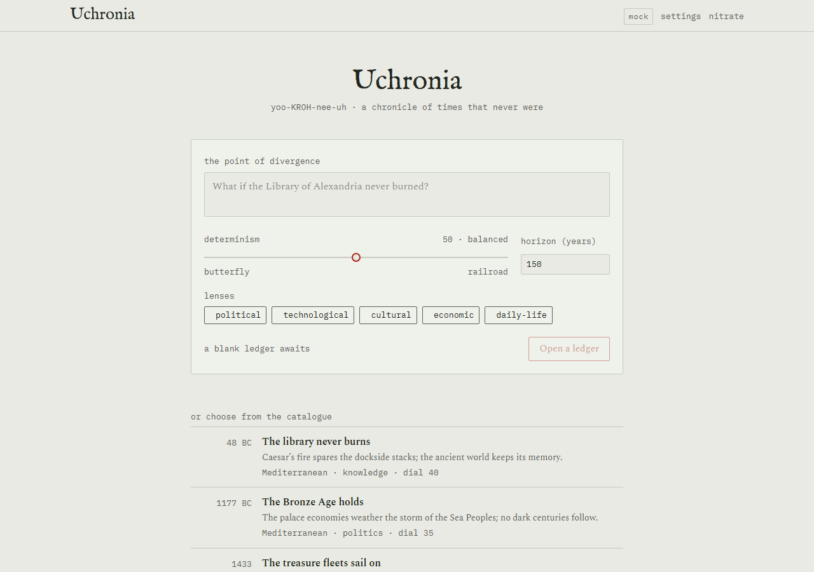
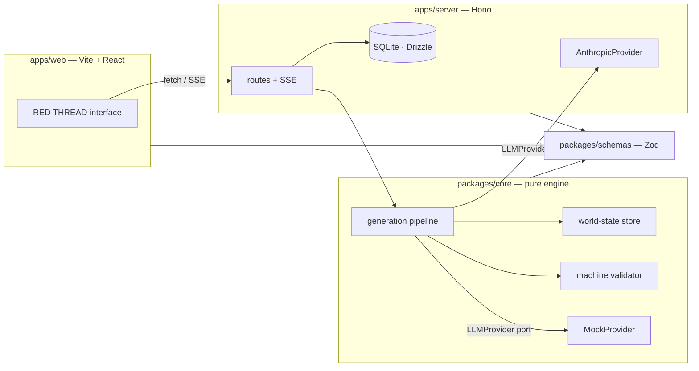

# Uchronia

**yoo-KROH-nee-uh** · *n.* — coined 1876 as the temporal counterpart of *utopia*: a time that never was.

> **git rebase for history.**

Uchronia is an alternate-history engine. Choose or write a **Point of Divergence** — *"the Library of Alexandria never burns"* — and watch history re-derive itself era by era. Drill into events, read biographies of people as they exist in this timeline, hold fake primary sources generated from inside the world, fork sub-branches at any event, and compare everything against real history.


<p align="center"><em>Survey by day, Nitrate by night:</em></p>


## Not a listicle generator

Uchronia is a lightweight causal simulation wearing a literary interface:

- Generation is grounded in **explicit, mutable world-state** — entities, deltas, a causal graph — never in accumulated prose.
- Every claim is **auditable** back through the graph.
- A skeptical **LLM critic** and a pure-code **machine validator** police every batch of generated history.

The prose is the surface. The graph is the truth.

## Features

- **POD studio** — freeform divergence composer plus a curated gallery of twelve starting points, from the Bronze Age Collapse to a Carrington-class storm in 1989.
- **The spine** — a vertical timeline where the Prussian-blue line of the real record visibly splits at your divergence, the red thread of the counterfactual peeling away from it.
- **Red-thread causality** — hover any event and literal red threads draw to its causal ancestors and descendants.
- **Determinism dial** — from *butterfly* (contingency compounds into chaos) to *railroad* (geography, demographics, and economics drag history back toward its attractors).
- **Convergence detection** — the engine flags moments where your divergent timeline rhymes back into real history.
- **Dossiers** — every person, nation, technology, and institution keeps a state ledger; biographies are written from inside the timeline.
- **Diegetic artifacts** — newspaper front pages, personal letters, encyclopedia entries, and propaganda posters, typeset as period primary sources.
- **Branching** — fork at any event with an optional sub-POD; compare any two branches, or a branch against the real record.
- **Export** — full JSON, markdown, and a self-contained static HTML edition of any branch.

| | |
| --- | --- |
|  |  |
|  |  |

## Quickstart

Requires Node ≥ 22 and pnpm (`corepack enable pnpm`).

```sh
pnpm install

# Without an API key — full demo on the deterministic mock engine:
UCHRONIA_MOCK=1 pnpm dev

# With a key — live generation:
cp .env.example .env   # put ANTHROPIC_API_KEY in .env (server-side only)
pnpm dev
```

Web app: http://localhost:5173 · API: http://localhost:8787

Everything in the UI is reachable in mock mode; CI runs exclusively keyless.

**Try the bundled demo:** Settings → *import a ledger* → [`demo/the-unburnt-library.uchronia.json`](demo/the-unburnt-library.uchronia.json) — an Alexandria timeline with 67 events across two branches, disputed entries, convergence points, and diegetic artifacts, all mock-derived.

## Architecture



## Philosophy

1. **State-grounded generation.** Events mutate explicit entity state via recorded deltas; new generation conditions on the current state snapshot, never on prose. Consistency is enforced by the data model, not hoped for.
2. **Ripple propagation.** Consequences radiate in waves — disciplined near the divergence, freer decades out.
3. **Determinism dial and convergence.** Contingency versus structural attractors is a user-facing control, and the moments where the counterfactual rhymes back into real history are surfaced as first-class marks.
4. **Dual review.** A machine validator that cannot be argued with, and a skeptical historian-critic that flags anachronism, teleology, great-man overreach, presentism, and cliché collapse. What fails is regenerated; what persists in failing is kept but visibly marked *disputed*.
5. **Lazy generation.** Skeleton first, depth on demand. Nothing dense is generated unread.
6. **Anti-cliché mandates.** Consequences must span structural, cultural, economic, and mundane registers — prices, fashions, slang — not just wars and treaties.

## A note on sensitive history

Alternate history touches real atrocity and real grief. Every generation prompt embeds a sober, historiographic register; counterfactuals involving mass suffering are treated with the gravity of the real events they mirror, and the critic treats tonal violations as failures.

**Uchronia's outputs are speculative fiction produced by a language model — a thinking toy, not scholarship, and not a source.**

## License

[MIT](LICENSE) © 2026 Vignesh Nagarajan
