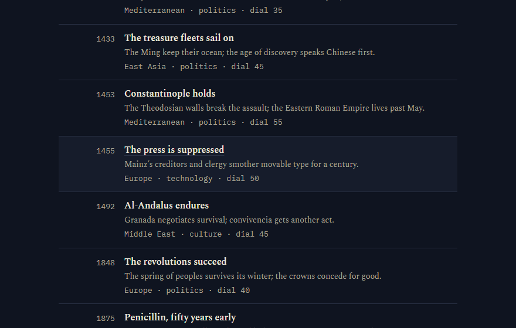
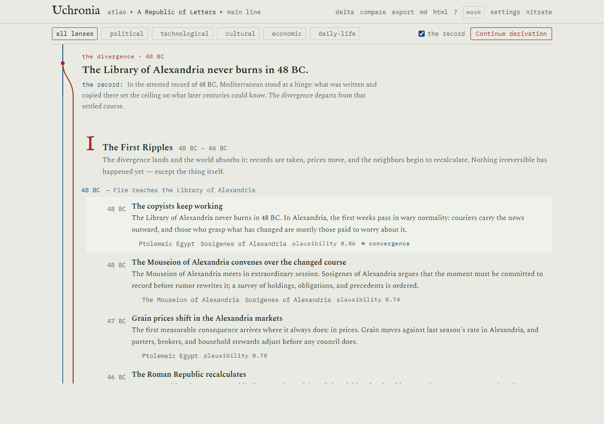
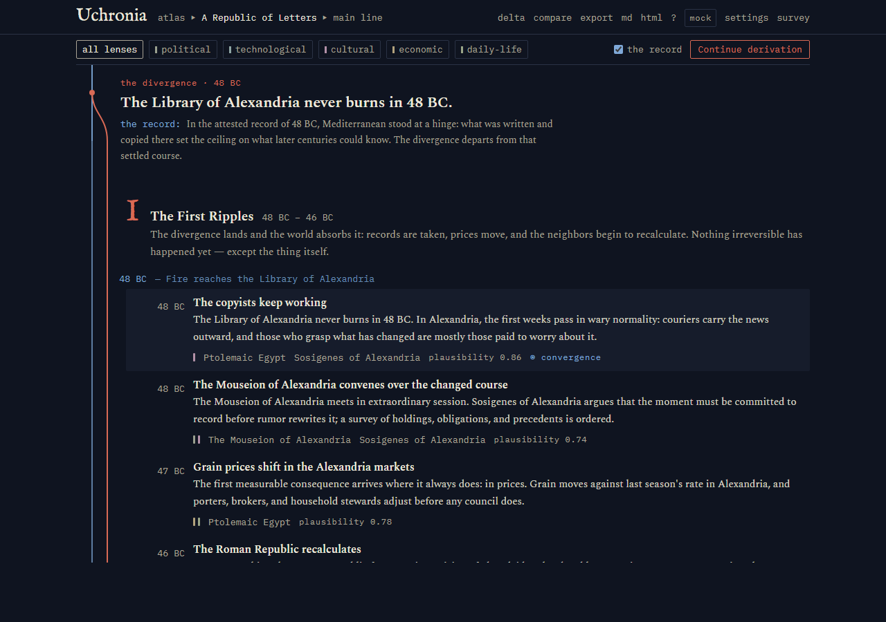
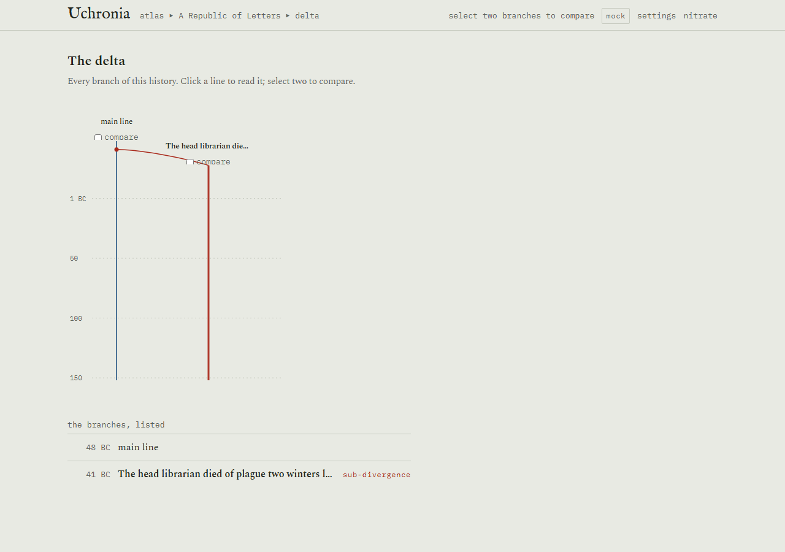
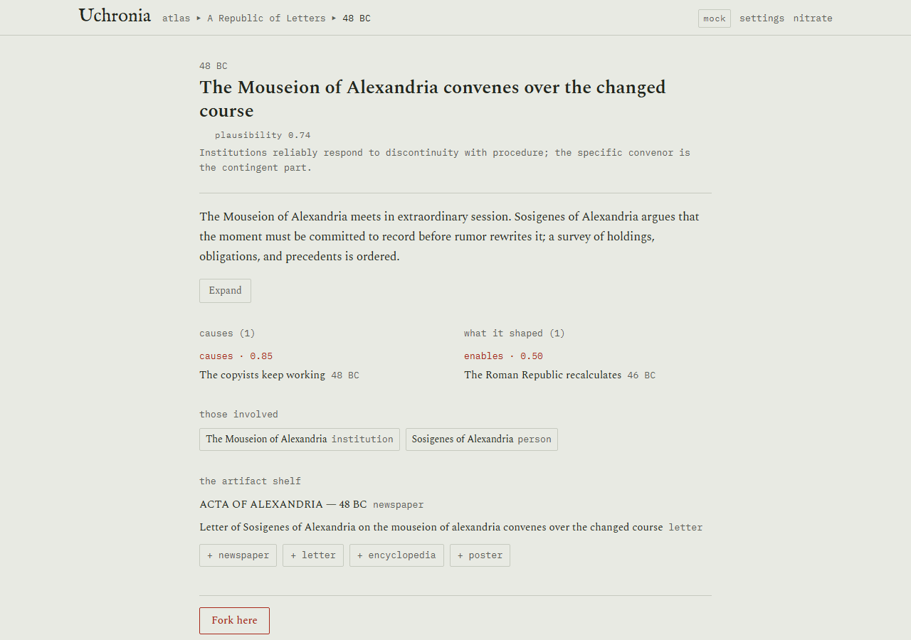
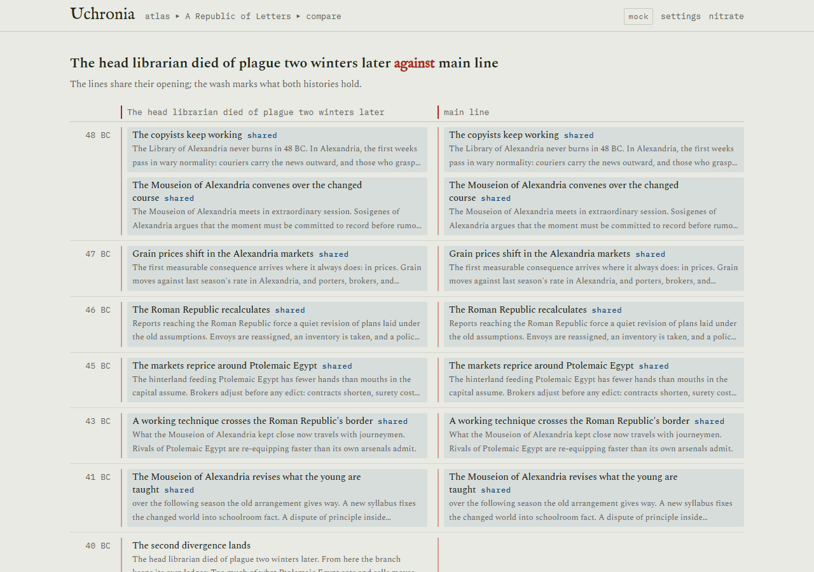
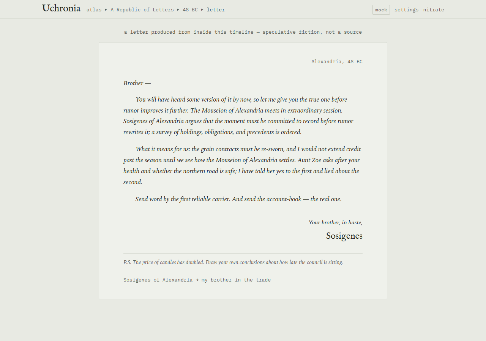
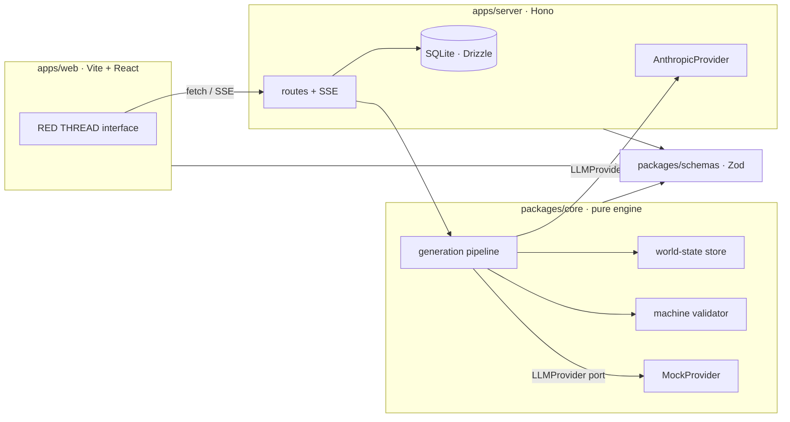

#  Uchronia: Alternate History Engine

**yoo-KROH-nee-uh** · *n.*, coined 1876 as the temporal counterpart of *utopia*: a time that never was.

> **git rebase for history.**

[](https://github.com/vignesh-nagarajan-vn/uchronia/actions/workflows/ci.yml)
[](LICENSE)
[](package.json)

**Live playground**: [uchronia-server.vercel.app](https://uchronia-server.vercel.app/) - keyless demo mode, with four showcase chronicles seeded on arrival, including *The Allies Lose*.

Uchronia is an alternate-history engine. Choose or write a **Point of Divergence**, say *"the Library of Alexandria never burns"*, and watch history re-derive itself era by era. Drill into events, read biographies of people as they exist in this timeline, hold fake primary sources generated from inside the world, fork sub-branches at any event, and compare everything against real history.



<p align="center"><em>One keyless minute: choose a divergence, watch the ledger ink in beside the record, pull a thread.</em></p>

| | |
| --- | --- |
|  |  |

<p align="center"><em>Survey by day, Nitrate by night.</em></p>

## Not a listicle generator

Uchronia is a lightweight causal simulation wearing a literary interface:

- Generation is grounded in **explicit, mutable world-state** (entities, deltas, a causal graph), never in accumulated prose.
- The graph feeds the loop: new eras must extend or close the causal chains of the old, and the skeptical critic judges every claimed cause **by what it actually cites**.
- Every claim is **auditable** back through the graph, and a pure-code **machine validator** (twelve rules, including *no posthumous mutation*: the dead stay dead) polices every batch beside the LLM critic.
- The record it diverges from is real: **1578 curated anchors**, 4000 BC to 2024, fact-checked and hand-assembled, and never generated.

The prose is the surface. The graph is the truth.

## What v2 added

*The Second Derivation* exists because of one failure: someone asked what if the
Allies lost the Second World War and got a canned history set in the 1600s. The
north star was that **the engine answers the question asked, provably.**

- **It reads your ask before deriving.** An interpretation card offers real
  divergence mechanisms, grounded in retrieved anchors from the curated record,
  and nothing is created until you confirm or edit it.
- **It says what engine it is.** No key means demo mode, and demo mode says so
  in a banner rather than in a whisper.
- **1578 curated anchors**, 4000 BC to 2024, with themes, magnitude, and how
  strongly structure pulls back toward each one.
- **Deep time by default**: a divergence runs to the present, with an optional
  epilogue era marked as a projection rather than a derivation.
- **A symposium mode**: three specialist historians draft each era and a fourth
  merges them, keeping what they could not settle as contested marginalia. And
  a Court of Plausibility that hears disputed events out.
- **Ask the archivist.** Every factual sentence is pinned to a row you can open,
  and "the record is silent on that" is a real answer.
- **Commission the chronicle** as a print-grade book or an EPUB.
- **A map**, deliberately schematic and captioned as such, with a data table
  carrying the same claims.
- **Ctrl+K** to get anywhere.

The full record, including everything deliberately not built, is in
[docs/ROADMAP.md](docs/ROADMAP.md) and [CHANGELOG.md](CHANGELOG.md).

## Tech stack

<p align="center"><b>Frontend</b></p>
<p align="center">
  
  
  
  
  
  
  
  
  
  
  
</p>

<p align="center"><b>Backend</b></p>
<p align="center">
  
  
  
  
  
  
</p>

<p align="center"><b>AI Reasoning</b></p>
<p align="center">
  
  
  
  
  
</p>

<p align="center"><b>Deployment &amp; Tooling</b></p>
<p align="center">
  
  
  
  
  
  
  
  
  
  
  
</p>

## Features

- **POD studio**: freeform divergence composer plus a curated gallery of twelve starting points, from the Bronze Age Collapse to a Carrington-class storm in 1989.
- **The spine**: a vertical timeline where the Prussian-blue line of the real record visibly splits at your divergence, the red thread of the counterfactual peeling away from it. Search it, filter it by lens, walk it entirely from the keyboard.
- **Red-thread causality**: hover any event and literal red threads draw to its causal ancestors and descendants.
- **Determinism dial**: from *butterfly* (contingency compounds) to *railroad* (geography, demographics, and economics drag history back toward its attractors), and the critic's plausibility bar moves with it.
- **Convergence detection**: the engine flags moments where your divergent timeline rhymes back into real history, ranked by the divergence's own theatre.
- **Dossiers**: every person, nation, technology, and institution keeps a state ledger; biographies are written from inside the timeline; entities age, die, and dissolve for good.
- **Diegetic artifacts**: newspaper front pages, personal letters, encyclopedia entries, and propaganda posters, typeset as period primary sources.
- **Branching**: fork at any event with an optional sub-POD; compare any two branches, or a branch against the real record. Don't like an event? *Tell it again*: regenerated in place, validated before it lands.
- **Export**: full JSON, markdown, and a self-contained static HTML edition of any branch (typefaces embedded, readable decades from now).

| | |
| --- | --- |
|  |  |
|  |  |

## Quickstart

Requires Node ≥ 22.13 (pnpm 11's own floor) and pnpm (`corepack enable pnpm`).

```sh
pnpm install

# Without an API key: the full product on the deterministic mock engine,
# with pacing on so you can watch history ink in (works on every OS):
pnpm dev:mock

# With a key (live generation):
cp .env.example .env   # uncomment ANTHROPIC_API_KEY and paste yours (server-side only;
pnpm dev               # the server loads the repo-root .env, real env vars win)
```

Web app: http://localhost:5173 · API: http://localhost:8787

Everything in the UI is reachable in mock mode; CI runs exclusively keyless. On the empty atlas, click **load the showcase chronicle** for an instant 67-event, two-branch Alexandria timeline with disputes, convergences, and artifacts.

Prefer a container? `docker build -t uchronia . && docker run -p 8787:8787 -v uchronia-data:/data uchronia`: one port, keyless, safe to host. See [docs/DEPLOY.md](docs/DEPLOY.md).

Or skip the install entirely: this repo is deployed on Vercel via its `vercel.json`, live at **[uchronia-server.vercel.app](https://uchronia-server.vercel.app/)**. Serverless state lives in `/tmp` per instance and resets on every redeploy - a playground, not an archive. Full deployment story: [docs/DEPLOY.md](docs/DEPLOY.md).

<details>
<summary><strong>Troubleshooting</strong></summary>

- **`corepack enable pnpm` fails on Windows**: run the terminal elevated once, or `npm i -g corepack@latest` first (older corepack signatures expired).
- **`UCHRONIA_MOCK=1 pnpm dev` errors in PowerShell**: that's POSIX syntax; use `pnpm dev:mock`, which is cross-platform (or `$env:UCHRONIA_MOCK='1'; pnpm dev`).
- **better-sqlite3 build errors**: it ships prebuilt N-API binaries for Node 22/24 on all three OSes; `pnpm install` again after upgrading Node rather than mixing versions.
- **Port taken**: `UCHRONIA_PORT` moves the API; the web dev server proxies `/api` to 8787 by default.

</details>

## Architecture



## Documentation

The engine is specified, not just implemented: [ARCHITECTURE](docs/ARCHITECTURE.md) (system map, ports, error taxonomy) · [DATA_MODEL](docs/DATA_MODEL.md) (schemas, fork semantics, the validator) · [GENERATION](docs/GENERATION.md) (pipeline stages, prompt registry, dial mapping, dual review) · [DESIGN](docs/DESIGN.md) (the binding RED THREAD spec) · [DEPLOY](docs/DEPLOY.md) (static exports, Vercel, Docker, live-mode rules) · [TESTING](docs/TESTING.md) · [ROADMAP](docs/ROADMAP.md) (honest status, open threads) · [CONTRIBUTING](CONTRIBUTING.md) · decision records in [docs/adr](docs/adr/).

## Philosophy

1. **State-grounded generation.** Events mutate explicit entity state via recorded deltas; new generation conditions on the current state snapshot, never on prose. Consistency is enforced by the data model, not hoped for.
2. **Ripple propagation.** Consequences radiate in waves: disciplined near the divergence (any divergence, including a fork's), freer decades out.
3. **Determinism dial and convergence.** Contingency versus structural attractors is a user-facing control, and the moments where the counterfactual rhymes back into real history are surfaced as first-class marks.
4. **Dual review.** A machine validator that cannot be argued with, and a skeptical historian-critic that flags anachronism, teleology, great-man overreach, presentism, and cliché collapse. What fails is regenerated; what persists in failing is kept but visibly marked *disputed*.
5. **Lazy generation.** Skeleton first, depth on demand. Nothing dense is generated unread.
6. **Anti-cliché mandates.** Consequences must span structural, cultural, economic, and mundane registers (prices, fashions, slang), not just wars and treaties.

## A note on sensitive history

Alternate history touches real atrocity and real grief. Every generation prompt embeds a sober, historiographic register; counterfactuals involving mass suffering are treated with the gravity of the real events they mirror, and the critic treats tonal violations as failures.

**Uchronia's outputs are speculative fiction produced by a language model: a thinking toy, not scholarship, and not a source.**

## License

[MIT](LICENSE) © 2026 Vignesh Nagarajan
